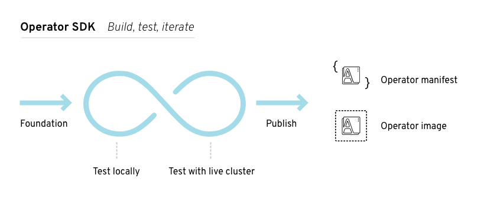
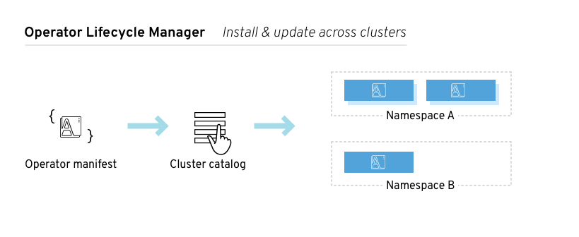

SRE（网站可靠性工程师），他们会将自己的运维技能写成软件，从而完成一定程度上的自动化运维。这些软件融合了这些工程师（开发者）在某一领域的专业知识。而operator的目标就是将某领域内的专业知识以软件的形式实现出来。

Operaotr是CoreOS推出的旨在简化复杂有状态应用管理的框架，它是一个感知应用状态的控制器，通过扩展Kubernetes API来自动创建、管理和配置应用实例。它基于基础的k8s Resource和Controller的概念，结合了一些应用特有知识来完成一些普通任务的自动化。例如，一个mysql operator 会融合进一个专业DBA的运维知识，实现mysql集群的创建、维护、备份、备份恢复等mysql特定运维操作。再举一个etcd的例子，当扩展一个etcd集群时，需要有如下几步：1. 为新的etcd节点创建DNS名字。2. 登陆到这个节点，使用etcd的管理工具通知etcd集群加入新节点。而使用Operator的化，用户直接简单的将集群节点加一就行，具体的步骤operator内部都已经实现好。

### Stateless 容易，Stateful 难
在k8s中管理无状态的应用是很容易的。直接可以使用k8s自带的一些资源对象就可以轻易实现，例如Deployments。难的是管理一些有状态应用，比如数据库、缓存、监控系统等。这些有状态应用需要一些专业的知识去维护数据一面出现数据丢失或者数据不一致的问题。这些地方就需要Operator来实现。

### Operator 工作原理
Operator 用到了k8s中两种重要的概念：Resource和Controller。一个Resource让用户可以定义一个期望的状态，而一个Controller就去通过操作来维护使其达到一个期望的状态。在K8s中，已经内置了很多Resource和对应的Controller，比如Services，Deployments，Jobs，Daemon Sets，StatefulSet这些。

### 如何创建Operator
根据Operator的定义可以发现，要实现一个Operator最重要的就是如何将某一领域的专业知识编码进一个有意义的Resource以及一个对应的控制回路。一些比较通用的意见：
1. Operator以deployment部署在k8s中。
2. Operator应该创建一个或多个新的资源类型（通过CRD实现）来供用户使用。
3. 多利用k8s内置的原语，比如services，ReolicaSet这些，因为这些都已经被广泛的实践了，容易理解也更安全。
4. 需要向后兼容，需要能够识别之前版本所创建的资源。
5. 应该被设计为即使Operator自身停掉了，其创建的资源仍然能够继续run。
6. 需要能够滚动升级的能力。
7. 能通过"Chaos MonKey"测试（模拟随机的Pod、配置、网络失败问题）

### 如何使用Operator
以官方提供的etcd operator为例

**Install Operator**
```bash
# 创建RBAC规则
$ example/rbac/create_role.sh
# 安装etcd operator
$ kubectl create -f example/deployment.yaml
# 其中的deployment.yaml
apiVersion: extensions/v1beta1
kind: Deployment
metadata:
  name: etcd-operator
spec:
  replicas: 1
  template:
    metadata:
      labels:
        name: etcd-operator
    spec:
      containers:
      - name: etcd-operator
        image: quay.io/coreos/etcd-operator:v0.9.2
        command:
        - etcd-operator
        # Uncomment to act for resources in all namespaces. More information in doc/clusterwide.md
        #- -cluster-wide
        env:
        - name: MY_POD_NAMESPACE
          valueFrom:
            fieldRef:
              fieldPath: metadata.namespace
        - name: MY_POD_NAME
          valueFrom:
            fieldRef:
              fieldPath: metadata.name
# etcd的operator会自动的创建一个CRD
$ kubectl get customresourcedefinitions
NAME                                    KIND
etcdclusters.etcd.database.coreos.com   CustomResourceDefinition.v1beta1.apiextensions.k8s.io
```
**Uninstall Operator**

Operator被设计为即使operator被删除，其resource也可以继续使用。所以要清理环境的化，除了删除operator还要删除相关的resource
```
kubectl delete -f example/deployment.yaml
kubectl delete endpoints etcd-operator
kubectl delete crd etcdclusters.etcd.database.coreos.com
kubectl delete clusterrole etcd-operator
kubectl delete clusterrolebinding etcd-operator
```

**使用etcd-operator管理etcd集群**
```bash
# 创建
$ kubectl create -f example/example-etcd-cluster.yaml
$ kubectl get pods
NAME                            READY     STATUS    RESTARTS   AGE
example-etcd-cluster-gxkmr9ql7z   1/1       Running   0          1m
example-etcd-cluster-m6g62x6mwc   1/1       Running   0          1m
example-etcd-cluster-rqk62l46kw   1/1       Running   0          1m

# 删除
$ kubectl delete -f example/example-etcd-cluster.yaml

# Resize
将集群个数从3个改成5个（同样，如果我们不改size，而是改version，那么就相当于进行了版本升级操作，而etcd-operator会很好的处理。
$ cat example/example-etcd-cluster.yaml
apiVersion: "etcd.database.coreos.com/v1beta2"
kind: "EtcdCluster"
metadata:
  name: "example-etcd-cluster"
spec:
  size: 5
  version: "3.2.13"
$ kubectl apply -f example/example-etcd-cluster.yaml

# Failover
创建集群之后模拟其中一个节点down掉了
$ kubectl delete pod example-etcd-cluster-cl2gpqsmsw --now
# etcd operator 会自动的创建一个新的，确保有三个节点
$ kubectl get pods
NAME                            READY     STATUS    RESTARTS   AGE
example-etcd-cluster-gxkmr9ql7z   1/1       Running   0          10m
example-etcd-cluster-n4h66wtjrg   1/1       Running   0          26s
example-etcd-cluster-rqk62l46kw   1/1       Running   0          10m
```

### Operator Framework
OperatorFramework可以帮助开发者加快开发一个operator，包含一下几个组件：Operator SDK，Operator lifecycle manager， operator metering

#### 使用Operator SDK

SDK 提供了创建、测试、打包operator的工具。

#### Operator生命周期管理

Operator创建好了之后，需要在一个k8s集群上安装。而Operator lifecycle manager组件提供了对安装后的Operator的基本管理，比如决定哪些operator在哪些ns上可见以及对哪些人可见等等，甚至还能管理operator所创建的Resource
